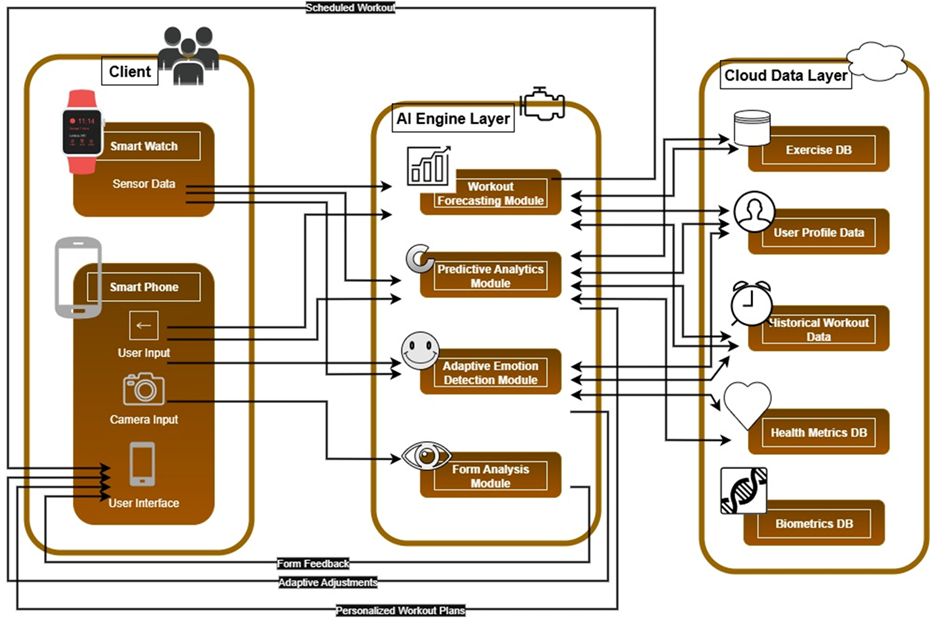

# FitForge AI: AI-Powered Personalized Gym Assistant


## 📖 Project Overview


[cite_start]**FitForge AI** is a smart fitness coaching system designed to turn any smartphone into a personal trainer[cite: 12]. [cite_start]It addresses the limitations of traditional fitness apps by providing a fully automated, hands-free, and adaptive workout experience[cite: 13].

[cite_start]Unlike standard apps that rely on manual input and generic templates, FitForge AI uses computer vision and predictive analytics to autonomously track exercises, analyze form in real-time, and generate dynamic workout schedules based on user performance and recovery needs[cite: 30, 168, 351].

---

## 🚩 Problem Statement

* [cite_start]**Manual Distractions:** Traditional apps require users to manually input data (reps/sets) or use touch controls, which breaks focus and is impractical during intense exercise[cite: 45, 169].
* [cite_start]**Lack of Guidance:** Novice users often suffer from injuries due to incorrect form, with no real-time feedback available outside of expensive personal trainers[cite: 346].
* [cite_start]**Generic Planning:** Most apps provide "one-size-fits-all" schedules that fail to adapt to individual recovery rates and performance fluctuations[cite: 29].
* [cite_start]**Device Dependency:** Advanced tracking often requires expensive specialized hardware or wearables[cite: 276].

## 💡 Key Features

### 1. Zero-Interaction Fitness Tracking
A truly hands-free experience that allows users to focus solely on their workout.
* [cite_start]**Automated Recognition:** Uses computer vision (YOLOv11) to autonomously detect exercise start and end times[cite: 186, 232].
* [cite_start]**Smart Counting:** Automatically tracks sets and repetitions without manual input[cite: 187].
* [cite_start]**Flow Management:** Automatically calculates and manages rest periods between sets[cite: 226].

### 2. Real-Time Biomechanical Form Analysis
Functions as a vigilant spotter to ensure safety and effectiveness.
* [cite_start]**Skeletal Tracking:** Tracks 33 body keypoints at over 30 FPS using on-device processing[cite: 352].
* [cite_start]**Angle Calculation:** Measures critical joint angles (knees, elbows, spine) with high accuracy (±5 degrees) to detect deviations[cite: 353].
* [cite_start]**Instant Feedback:** Provides visual and audio corrective cues within 100ms of detecting an error to prevent injury[cite: 354].

### 3. Intelligent Workout Forecasting
Replaces static templates with dynamic, AI-driven planning.
* [cite_start]**Adaptive Scheduling:** Generates personalized workout plans that evolve based on historical performance and body data[cite: 17, 30].
* [cite_start]**Image-Based Analysis:** Analyzes body composition via smartphone images to tailor fitness plans[cite: 63, 128].
* [cite_start]**Progressive Overload:** Forecasts future workout needs to ensure consistent progress[cite: 98].

### 4. Predictive Health Analytics
Proactive insights to manage long-term health and performance.
* [cite_start]**Recovery Estimation:** Predicts recovery duration based on heart rate, calorie expenditure, and workload[cite: 319].
* [cite_start]**Risk Detection:** Identifies patterns indicating overtraining or potential injury risks before they occur[cite: 20, 298].
* [cite_start]**Performance Forecasting:** Models future strength and endurance trends to set realistic goals[cite: 320].

---

## 🏗 System Architecture

[cite_start]The system operates using a hybrid architecture balancing on-device processing for low latency with cloud computing for heavy data analysis[cite: 22].

* [cite_start]**Client Layer:** Native Android App handling User Interface, Sensor Data, and Camera Input[cite: 103].
* [cite_start]**AI Engine Layer:** Contains modules for Form Analysis, zero-interaction tracking, and Predictive Analytics[cite: 103].
* [cite_start]**Cloud Data Layer:** Manages User Profiles, Exercise Databases, and Historical Logs[cite: 103].

## 🛠 Technology Stack

### Mobile & Frontend
* [cite_start]**Platform:** Android (Native) [cite: 137]
* [cite_start]**IDE:** Android Studio [cite: 108]

### AI & Machine Learning
* [cite_start]**Languages:** Python [cite: 109]
* [cite_start]**Frameworks:** TensorFlow, PyTorch [cite: 110]
* [cite_start]**Vision Engine:** YOLOv11 (Pose Estimation) [cite: 232]
* **Algorithms:**
    * [cite_start]Convolutional Neural Networks (CNNs) [cite: 114]
    * [cite_start]RNN / LSTM (Time-Series Forecasting) [cite: 117]
    * [cite_start]Random Forest / Decision Trees [cite: 116]

### Backend & Database
* [cite_start]**Database:** MongoDB [cite: 111]
* [cite_start]**Cloud Services:** Google Cloud / AWS [cite: 113]
* [cite_start]**Version Control:** GitHub [cite: 112]

---

## 🚀 Getting Started

*(Note: Instructions below are placeholders. Update with specific repo commands)*

1.  **Clone the repository**
    ```bash
    git clone [https://github.com/your-username/fitforge-ai.git](https://github.com/your-username/fitforge-ai.git)
    ```
2.  **Open in Android Studio**
    * File -> Open -> Select project folder.
3.  **Sync Gradle**
    * Ensure all dependencies are installed.
4.  **Run on Device**
    * Connect an Android device with Camera permissions enabled.

## 📄 License
[Insert License Here]

---
[cite_start]*Developed by the FitForge AI Research Team - SLIIT Faculty of Computing [cite: 2]*