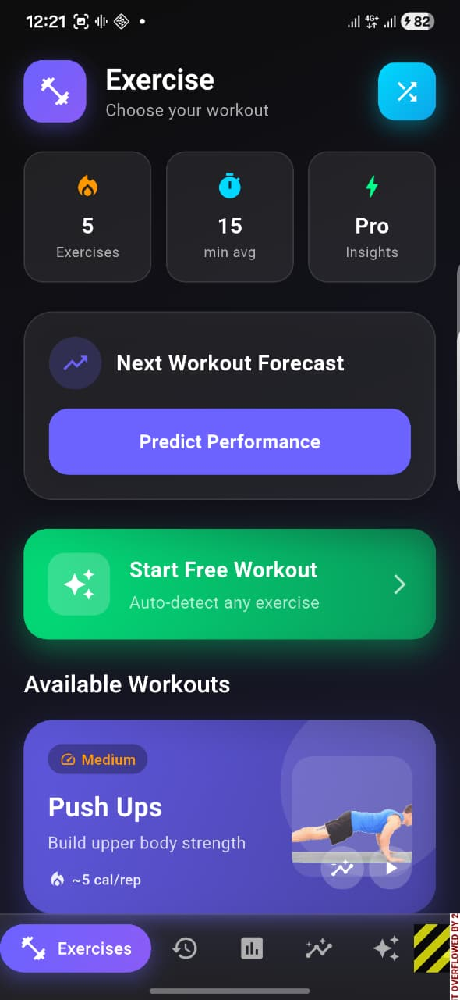
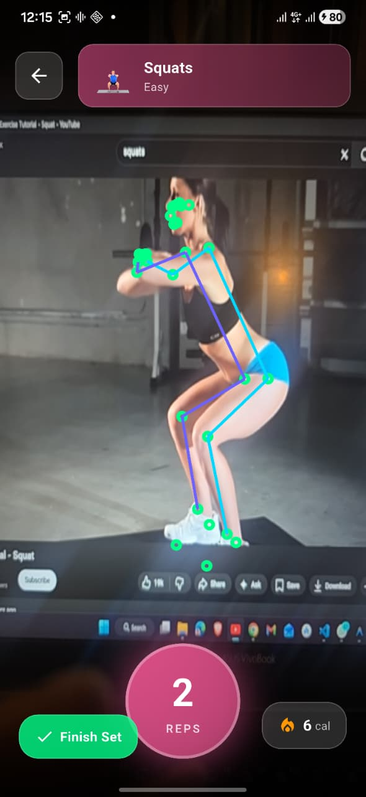
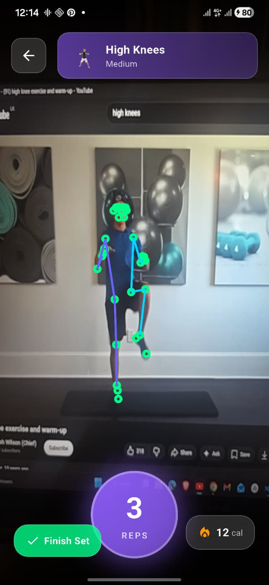
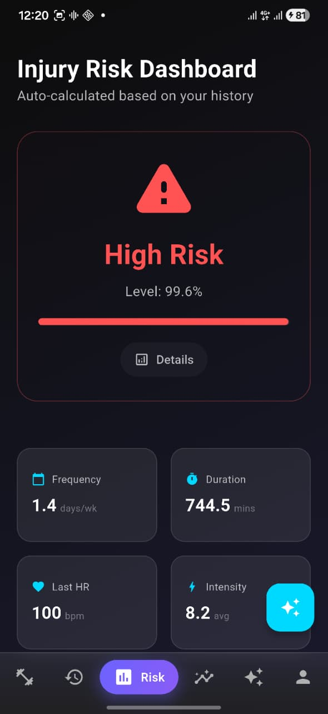
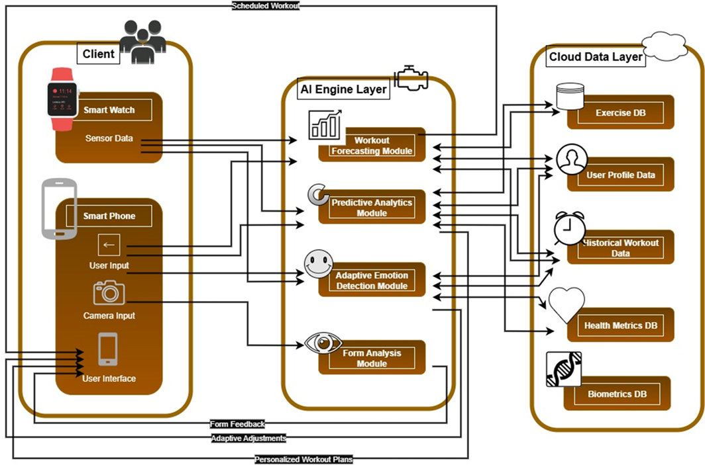

# FitForge AI: Zero-Interaction Personalized Fitness Coaching System

> **Research Project** — AI-Powered Exercise Detection with Real-Time Biomechanical Analysis, Injury Risk Prediction, and Adaptive Performance Forecasting

---

## 📋 Table of Contents

- [Project Overview](#project-overview)
- [Research Objectives](#research-objectives)
- [Screenshots](#screenshots)
- [System Architecture](#system-architecture)
- [Key Features](#key-features)
- [Technology Stack](#technology-stack)
- [AI & Machine Learning Models](#ai--machine-learning-models)
- [Database Architecture](#database-architecture)
- [Data Collection Pipeline](#data-collection-pipeline)
- [Backend API Endpoints](#backend-api-endpoints)
- [Project Structure](#project-structure)
- [Getting Started](#getting-started)
- [Research Documentation](#research-documentation)
- [Acknowledgements](#acknowledgements)

---

## Project Overview

**FitForge AI** is a cross-platform mobile application that transforms any smartphone into an intelligent personal fitness coach. The system employs a **zero-interaction paradigm** — the device camera serves as the sole input mechanism, eliminating the need for manual data entry, button presses, or screen interaction during workouts.

The application autonomously:
- **Detects** the exercise being performed using rule-based pose classification
- **Counts** repetitions through trigonometric state-machine analysis
- **Analyses** biomechanical form quality in real-time with audio/visual feedback
- **Predicts** injury risk using a trained Random Forest classifier
- **Forecasts** performance trends using LSTM neural networks and XGBoost regression
- **Advises** users through a Gemini AI-powered safety chatbot

Originally conceived as a native Android application with YOLOv11, the project evolved into a **Flutter (Dart)** application utilising **Google ML Kit** for high-performance, on-device pose detection and **Supabase** for cloud data persistence.

---

## Research Objectives

1. Develop a zero-interaction fitness tracking system that requires no manual user input during exercise sessions.
2. Implement real-time biomechanical form analysis using on-device pose estimation and the Law of Cosines for joint angle calculation.
3. Design and train machine learning models for injury risk classification and performance fatigue forecasting.
4. Integrate a generative AI chatbot (Google Gemini) to provide personalised, context-aware safety recommendations.
5. Evaluate the system's accuracy, latency, and user experience against conventional fitness tracking approaches.

---

## Screenshots

| Home Screen | Squat Detection | High Knees Detection | Injury Risk Dashboard |
|:-----------:|:---------------:|:--------------------:|:---------------------:|
|  |  |  |  |
| Exercise catalogue with next workout forecast & auto-detect launcher | Real-time skeleton overlay with 33 keypoints, rep counting, and calorie tracking | Pose landmark tracking with bilateral joint angle calculation | ML-based risk classification (Random Forest) with probability score |

<p align="center">
  <em>Left to right: Exercise Home Screen • Real-Time Squat Detection with Skeleton Overlay • High Knees Pose Tracking • Injury Risk Dashboard with AI Predictions</em>
</p>

---

## System Architecture

<p align="center">
  
</p>

<p align="center"><em>Figure 1: High-Level System Architecture — Client, AI Engine Layer, and Cloud Data Layer</em></p>

The system follows a **three-tier architecture**:

| Tier | Components | Description |
|------|-----------|-------------|
| **Presentation Layer** | Flutter Mobile App | Camera interface, exercise screens, dashboards, AI chat |
| **Processing Layer** | On-Device (ML Kit) + Flask Backend | Pose detection, form analysis, ML inference, Gemini API proxy |
| **Data Layer** | Supabase PostgreSQL + Model Store | User profiles, workout history, serialised ML models (.pkl, .h5) |

---

## Key Features

### 1. Zero-Interaction Fitness Tracking
- Automatically tracks sets and repetitions without manual input using on-device computer vision.
- Manages workout flow and calculates rest periods automatically based on real-time performance.
- The camera is the **only input** — no buttons, no typing, no interaction required during the workout.

### 2. Auto-Exercise Detection
- **ExerciseClassifier** uses rule-based posture matching to identify 5 exercises:
  - Push-Ups, Squats, High Knees, Jumping Jacks, Plank to Downward Dog
- Requires **5 consecutive frame detections** for stability before confirming the exercise type.
- Transitions seamlessly from detection mode to counting mode.

### 3. Real-Time Biomechanical Form Analysis
- **Google ML Kit Pose Detection** extracts 33 body keypoints at ~30fps.
- **FormAnalyzer** applies per-exercise rule-based scoring (0–100):
  - Push-ups: Hip sag detection (torso angle < 150°), arm asymmetry (> 20° difference)
  - Squats: Knee cave detection (knee gap < 80% of ankle gap), forward lean
  - High Knees: Knee height validation, leaning back detection
- Live audio feedback via **flutter_tts** (e.g., *"Keep your back straight!"*)
- Visual skeleton overlay with red indicators on faulty joints.

### 4. Risk Assessment Engine
- **RiskAssessmentEngine** continuously tracks bilateral joint imbalance (left/right elbow, knee, shoulder differentials).
- Computes composite asymmetry: `currentImbalance = (elbowDiff + kneeDiff + shoulderDiff) / 3.0`
- Tracks `max_depth_angle` using running-minimum of average knee angles per rep.
- Metrics are atomically captured per-rep via `fetchAndResetMetrics()`.

### 5. Injury Risk Prediction (ML)
- **scikit-learn Random Forest Classifier** trained on 12 biomechanical and physiological features.
- Binary classification: **High Risk (1)** / **Low Risk (0)** with calibrated probability scores.
- Features: Age, Gender, Height, Weight, BMI, Training Frequency, Training Duration, Warmup Time, Flexibility Score, Muscle Asymmetry, Injury History, Training Intensity.
- Auto-increments `injury_count` in the user profile when high risk is detected.

### 6. Performance Forecasting
- **LSTM Neural Network** (TensorFlow/Keras) analyses the last 3–5 exercise sets to detect fatigue degradation patterns.
- **XGBoost Regressor** forecasts predicted next rep count from 9 rolling features (intensity, volume, rest patterns).
- Rule-based heuristics compute Volume Influence, Trend Progression, and Rest Influence scores.

### 7. AI Safety Advisor (Gemini Chatbot)
- **Google Gemini 2.5 Flash** provides personalised injury risk reduction suggestions.
- Structured JSON output with priority levels (🔴 High / 🟡 Medium / 🟢 Low).
- Interactive follow-up chat with injected risk profile context.
- Backend proxy pattern via Flask to manage API keys and rate limiting.

### 8. Adaptive Workout Scheduling
- AI-generated workout plans stored in Supabase.
- Auto-triggers rest timer and set transitions when target reps are reached.
- Dynamically adjusts volume and rest periods based on performance predictions.

---

## Technology Stack

### Mobile Frontend
| Technology | Purpose |
|-----------|---------|
| Flutter (Dart) | Cross-platform UI framework |
| `camera` | Real-time camera frame acquisition |
| `google_mlkit_pose_detection` | On-device 33-keypoint skeletal tracking (BlazePose CNN) |
| `flutter_tts` | Text-to-Speech audio form feedback |
| `fl_chart` | Performance trend visualisation |
| `supabase_flutter` | Authentication & real-time database sync |

### Backend Services
| Technology | Purpose |
|-----------|---------|
| Python Flask | REST API server (`unified_backend.py`) |
| Flask-CORS | Cross-origin mobile client support |
| scikit-learn | Injury risk classification (Random Forest) |
| TensorFlow/Keras | LSTM performance prediction model |
| XGBoost | Next rep count regression forecasting |
| joblib / pandas | Model serialisation & data preprocessing |
| Google Gemini API | AI chatbot (gemini-2.5-flash-lite) |

### Cloud & Database
| Technology | Purpose |
|-----------|---------|
| Supabase (PostgreSQL) | User profiles, workout history, form analyses |
| Supabase Auth | User authentication & session management |

---

## AI & Machine Learning Models

| Model | Type | File | Input | Output |
|-------|------|------|-------|--------|
| **BlazePose CNN** | Pose Estimation | On-device (ML Kit) | Camera frame | 33 skeletal keypoints (X, Y) |
| **Injury Risk Classifier** | Random Forest | `injury_risk_model.pkl` | 12-feature vector | Binary (High/Low Risk) + probability |
| **Performance LSTM** | Neural Network | `model/performance_lstm_model.h5` | 3-step sequence × 12 features | Binary (Good/Average) + confidence |
| **Rep Forecaster** | XGBoost Regressor | `performance_forecasting_model (1).pkl` | 9 rolling features | Predicted next rep count |
| **AI Safety Advisor** | LLM (Gemini 2.5 Flash) | Cloud API | Risk profile + prediction | Structured JSON suggestions |

---

## Database Architecture

FitForge AI utilises **Supabase PostgreSQL** to persist all workout data for ML model training and historical analysis.

### `users`
Stores persistent biometric profile fields.
- `id`, `age`, `height_cm`, `weight_kg`, `bmi`, `gender`, `injury_count`

### `workout_schedules`
AI-generated or user-managed workout plans.
- `user_id`, `exercise_name`, `target_sets`, `target_reps`, `rest_time_seconds`, `scheduled_date`

### `exercise_sets`
Parent record for each completed set of an exercise.
- `id`, `user_id`, `exercise_name`, `set_number`, `total_reps`, `duration_seconds`, `intensity`, `form_quality_score`, `muscle_asymmetry_score`, `heart_rate`, `actual_rest_time_seconds`, `exercise_date`, `exercise_time`

### `exercise_reps`
High-granularity biomechanical data for **each individual repetition**.
- `id`, `set_id`, `user_id`, `rep_number`, `time_since_last_rep`, `max_depth_angle`, `left_right_imbalance_degrees`, `form_quality_score`, `joint_angles`, `created_at`

### `form_analyses`
Detailed form quality records for reps with detected issues.
- `id`, `set_id`, `form_quality_score`, `muscle_asymmetry_score`, `joint_angles`, `detected_issues`, `feedback_message`

---

## Data Collection Pipeline

The system implements a seamless, zero-interaction pipeline from camera sensor to cloud database:

```
Camera Stream → Frame Throttling (isBusy lock) → ML Kit Pose Detection
    → 33 Landmarks → ExerciseClassifier (5-frame consensus)
    → Rep Counter (angle state machine) + FormAnalyzer + RiskAssessmentEngine
    → _recordRep() → atomic metric capture → _finishSet()
    → Supabase sync (exercise_sets + exercise_reps + form_analyses)
```

1. **Video Stream Input:** The `camera` plugin captures frames in `NV21` (Android) or `BGRA8888` (iOS) format.
2. **On-Device Pose Estimation:** Frames are processed by **Google ML Kit BlazePose**, extracting 33 2D skeletal keypoints with zero network latency.
3. **Biomechanical Calculation:** The **Law of Cosines** computes joint angles: `θ = arccos((ab² + bc² - ac²) / 2·ab·bc) × 180/π`
4. **State Machine Rep Counting:** Repetitions are validated when specific angle thresholds are crossed (e.g., elbow < 90° then > 160° for push-ups).
5. **Metric Accumulation:** During each rep, `RiskAssessmentEngine` tracks bilateral imbalance and depth, while `FormAnalyzer` scores form quality and detects faults.
6. **Data Sync:** On set completion, all granular per-rep data and set summaries are bundled and synced to Supabase via authenticated REST API.

---

## Backend API Endpoints

The Python Flask backend (`backend/unified_backend.py`) exposes the following endpoints:

| Endpoint | Method | Description |
|----------|--------|-------------|
| `/predict-injury-risk` | POST | Injury risk classification (12-feature input → prediction + probability) |
| `/predict_lstm` | POST | LSTM performance prediction (3-session sequence → Good/Average) |
| `/forecast_performance` | POST | XGBoost next rep count regression (9 features → predicted reps) |
| `/risk-suggestions` | POST | Gemini AI safety suggestions (risk profile → structured JSON) |
| `/risk-chat` | POST | Gemini follow-up conversation (message + context → reply) |

### Running the Backend

```bash
cd backend
pip install -r requirements.txt
python unified_backend.py
```

The server starts on `http://0.0.0.0:5000`. Update `lib/utils/api_config.dart` with your machine's IP address for mobile-to-desktop communication over local WiFi.

---

## Project Structure

```
FitForge AI/
├── lib/
│   ├── main.dart                          # App entry point & Supabase init
│   ├── screens/
│   │   ├── auto_detect_screen.dart        # Zero-interaction exercise detection & counting
│   │   ├── detection_screen.dart          # Scheduled workout detection screen
│   │   ├── exercises_screen.dart          # Exercise catalogue & home screen
│   │   ├── injury_risk_screen.dart        # Manual injury risk prediction form
│   │   ├── risk_dashboard_screen.dart     # Auto-calculated risk + AI Safety Advisor
│   │   ├── lstm_performance_insights_screen.dart  # LSTM + XGBoost forecasting UI
│   │   ├── manage_schedule_screen.dart    # Workout schedule management
│   │   ├── rest_timer_screen.dart         # Between-set countdown timer
│   │   ├── profile_screen.dart            # User biometric profile
│   │   ├── history_screen.dart            # Workout history viewer
│   │   └── auth/                          # Authentication screens
│   ├── utils/
│   │   ├── exercise_classifier.dart       # Rule-based auto-exercise detection
│   │   ├── form_analyzer.dart             # Real-time form quality scoring
│   │   ├── risk_assessment_engine.dart    # Bilateral imbalance & depth tracking
│   │   ├── lstm_session_mapper.dart       # Supabase data → LSTM input mapping
│   │   └── api_config.dart                # Centralised API endpoint configuration
│   ├── models/                            # Data models (request/response classes)
│   └── services/                          # API service layer (HTTP clients)
├── backend/
│   ├── unified_backend.py                 # Flask API server (all endpoints)
│   ├── performance_api.py                 # Standalone performance API
│   ├── requirements.txt                   # Python dependencies
│   └── models/                            # LSTM model artifacts
├── model/
│   ├── performance_lstm_model.h5          # Trained LSTM model (TensorFlow)
│   ├── lstm_scaler.pkl                    # Feature scaler
│   ├── lstm_name_encoder.pkl              # Name label encoder
│   └── lstm_exercise_encoder.pkl          # Exercise label encoder
├── injury_risk_model.pkl                  # Trained injury risk classifier
├── performance_forecasting_model (1).pkl  # XGBoost regression model
├── assets/                                # Exercise GIFs & workout data
├── screenshots/                           # Application screenshots
├── research_app.md                        # Mobile application architecture docs
├── research_model.md                      # AI & ML model documentation
├── research_datasets.md                   # Dataset architecture & collection pipeline
├── research_risk_prediction.md            # Injury risk prediction task list (60 tasks)
├── research_wrong_pose_detection.md       # Wrong pose detection system design
├── research_realtime_feedback.md          # Real-time form feedback system design
├── research_performance_prediction.md     # Performance & fatigue prediction docs
├── research_logbook.md                    # Research logbook (80 tasks)
└── README.md                              # This file
```

---

## Getting Started

### Prerequisites

- [Flutter SDK](https://docs.flutter.dev/get-started/install) (≥ 3.7.0)
- Android Studio or Xcode
- Python 3.9+ (for backend)
- A [Supabase](https://supabase.com/) project with the database schema defined above
- Physical Android/iOS device (camera + ML Kit require hardware)

### Installation

1. **Clone the repository:**
   ```bash
   git clone <repository-url>
   cd FitForge-AI
   ```

2. **Install Flutter dependencies:**
   ```bash
   flutter pub get
   ```

3. **Configure Supabase:**
   Update the `Supabase.initialize()` keys in `lib/main.dart` with your Supabase URL and Anon Key.

4. **Start the Python backend:**
   ```bash
   cd backend
   pip install -r requirements.txt
   python unified_backend.py
   ```

5. **Update API config:**
   Set your backend server IP in `lib/utils/api_config.dart`.

6. **Run the application:**
   ```bash
   flutter run
   ```
   > ⚠️ **Note:** Must run on a physical device. Emulators do not support camera-based ML Kit pose detection.

---

## Research Documentation

| Document | Description |
|----------|-------------|
| [`research_app.md`](research_app.md) | Mobile application architecture, core principles, and state flow |
| [`research_model.md`](research_model.md) | AI/ML model specifications (BlazePose, Random Forest, LSTM, XGBoost) |
| [`research_datasets.md`](research_datasets.md) | Dataset architecture, feature extraction, and Supabase schema design |
| [`research_risk_prediction.md`](research_risk_prediction.md) | Injury risk prediction system — 60 research tasks across 7 components |
| [`research_performance_prediction.md`](research_performance_prediction.md) | Performance forecasting with LSTM and adaptive scheduling |
| [`research_wrong_pose_detection.md`](research_wrong_pose_detection.md) | Wrong pose detection system — fault detection algorithms |
| [`research_realtime_feedback.md`](research_realtime_feedback.md) | Real-time form feedback — audio cues and visual skeletal augmentation |
| [`research_logbook.md`](research_logbook.md) | Complete research logbook — 80 documented development tasks |

---

## Acknowledgements

- **Google ML Kit** — On-device pose detection (BlazePose)
- **Supabase** — Backend-as-a-Service (PostgreSQL, Authentication)
- **Google Gemini API** — Generative AI for personalised safety advice
- **TensorFlow/Keras** — LSTM model training
- **scikit-learn** — Injury risk classification model
- **XGBoost** — Performance regression forecasting

---

*Developed as part of an undergraduate research project in Computer Science.*
*© 2025–2026 FitForge AI Research Team. All rights reserved.*